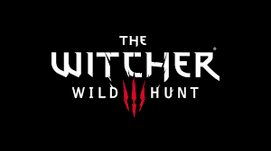

# witcher<!DOCTYPE html>
<html>
<head>
  <title>Witcher 3 Website</title>
  <link rel="stylesheet" type="text/css" href="./style.css">
</head>
<body>
  <header>
    

      

        
      

      

        <h1>The Most Epic RPG Experience: Witcher 3</h1>
        
Welcome to Geralt of Rivia's adventures! Witcher 3 will enchant you with its stunning graphics, immersive story, and exciting gameplay.

        <a href="#about" class="btn">Explore More</a>
      

    

  </header>
  
  <section id="about">
    

      <h2>About</h2>
      
Witcher 3 is an action role-playing game developed by CD Projekt RED. In the game, you control Geralt of Rivia as he battles monsters, completes quests, and progresses through the story in a vast open world.

      
Key features of Witcher 3 include:

      <ul>
        <li>A vast and detailed open world</li>
        <li>Epic main story and side quests</li>
        <li>Dangerous areas filled with different monsters</li>
        <li>Skill tree and item system</li>
        <li>Rich characters and interactive dialogues</li>
      </ul>
    

  </section>
  
  <section id="content">
    

      <h2>Gameplay</h2>
      
Witcher 3 offers a dynamic and immersive gameplay experience. As Geralt of Rivia, you can explore the expansive open world, take on challenging quests, and engage in thrilling combat against various monsters and enemies.

      
With a vast array of weapons, spells, and abilities at your disposal, you can customize Geralt's playstyle to suit your preferences. The game also features a deep crafting and alchemy system, allowing you to create powerful potions and equipment to aid you in your adventures.

      
Additionally, Witcher 3 incorporates a choice-driven narrative, where your decisions and actions have consequences that can influence the story and the world around you. The game's rich characters and complex relationships further enhance the immersive storytelling experience.

    

  </section>
  
  <!-- Other sections and content go here -->
  
  <footer>
    

      
      
&copy; 2023 Witcher 3 Website. All rights reserved.

    

  </footer>
</body>
</html>
/* General Styles */
